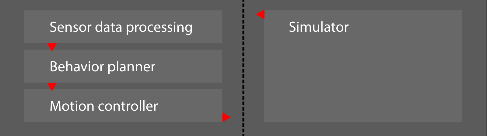
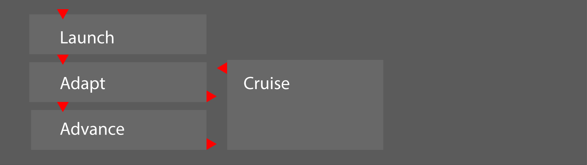
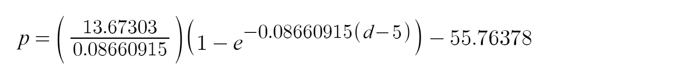
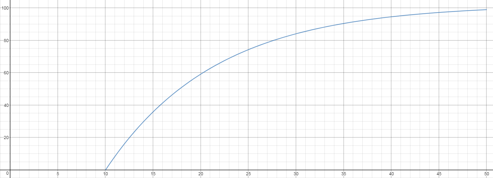
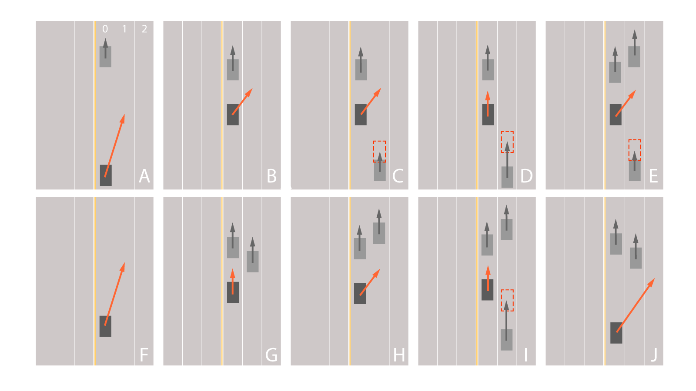
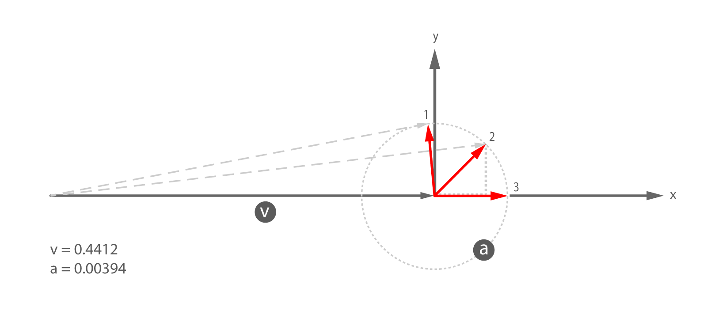
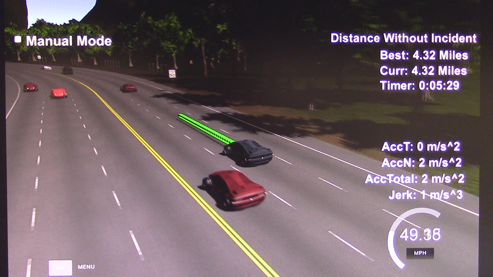
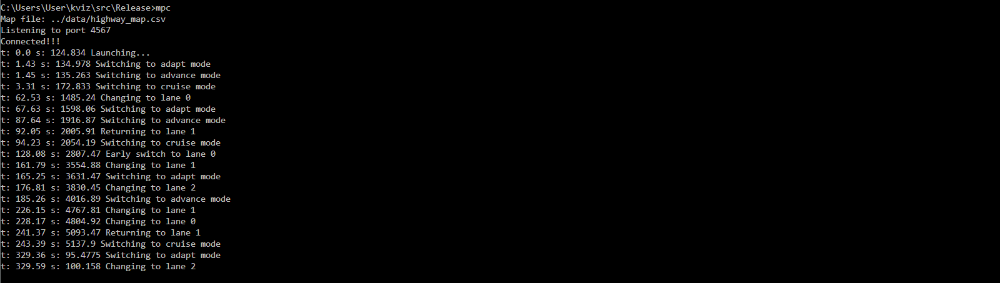
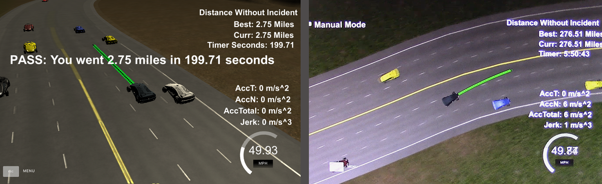

## Path Planning Project
Self-Driving Car Engineer Nanodegree Program

---
### Overview
The included source implements a path-planning motion controller to drive a simulated vehicle around a virtual race track. The over-arching goal is to safely navigate the track for at least 4.32 miles avoiding collision with other vehicles and staying on the track within a lane. Secondary goal is to minimize lap time by attempting to maintain a velocity near the speed limit. Motion must be smooth and within the prescribed tolerance for velocity (<50mph), acceleration (±10m/s<sup>2</sup>) and change in acceleration (±10m/s<sup>3</sup>) as measured by the simulator.

The primary vehicle (hereafter the "reference vehicle") moves along a precise trajectory transmitted by the controller. Like a supply chain provides a steady stream of goods or services, it is the responsibility of the controller to maintain an adequate queue of points (represented as a string of green spheres ahead of the reference vehicle in the simulator). A shortage would lead to an instantaneous halt in the animation, resulting is measurements of excessive force.

---
### The Model
The core tasks can be grouped into three areas as illustrated. The simulator sends fairly regular update messages containing telemetry data and sensor fusion data. The Sensor data processing area informs the Behavior planner which then governs the Motion controller to return a planned path to the simulator for execution:



Each component of the model is detailed below. 

##### Initialization
The track waypoints coincide with the yellow center line in the middle of the highway. Closed-loop splines are created to model each lane (2 splines `x,y` for each lane). The first and last values of the waypoint set are crossed to maintain curvature continuity. A multiple of the unit normal at each waypoint is used to offset a spline to the center of the lane.

##### Simulator update cycle
Moving the reference vehicle involves transmitting an array of coordinate pairs to the simulator on each update cycle. The simulator advances the vehicle along an array of coordinate pairs at a rate of one pair every 20 milliseconds (50 frames per second). At a lesser frequency, the simulator transmits data to the controller for an update cycle. Data sent includes unused trajectory points, vehicle state, and sensor data. The controller must make decisions based on this data and send updates back to the simulator. Overall, the reference vehicle is directed along the lane splines while maintaining velocity and safe distances from obstacle vehicles. 

#### Sensor Data Processing
The sensor data provided by the simulator contains position and velocity information about the obstacle vehicles on the right-hand side of the road.

Using the <i>s</i> and <i>d</i> coordinates in the raw sensor data, the linear distance, lane, and velocity of the closest vehicles in each lane is determined and stored for use by the behavior planner. The distance from the reference vehicle’s position is computed using a custom difference function (which uses modular mathematics). At the end of the track, some `s,d` pairs become zero for several frames. For that section, distance is computed using the global `x,y` coordinates.

For the closest vehicles ahead, a preferred lane is identified based on distance. Depending on the driving style described below, obstacle vehicles that drift too closely to the reference vehicle are "ghosted" into the current lane to force braking or acceleration.


#### Behavior Planner

The behavior section of the model is composed of 2 driving styles implemented with 4 modes and 10 rules based on safety measures, common sense, and observed behaviors by obstacle vehicles in the simulator. A "Conservative" style takes a few more precautions while navigating through traffic clusters. For example, the far lane is checked prior to merging to the middle lane. This can lead to reduced laps. A "Bold" style increases lap time, with reduced endurance.

Independent of the driving style, there are 4 modes which are managed as states in a finite state machine (FSM) as follows:



- <b>Launch:</b> linearly accelerates (with muted steering) at maximum throttle. Transitions to `Adapt` state at velocity target (in about 1.43 seconds).
- <b>Adapt:</b> matches the velocity of the vehicle ahead. Twenty second lane change (LC) cool-down. Transitions to `Advance` after a patience time expires (presently 15 seconds). Transitions to `Cruise` if target velocity is reached in an unobstructed lane. Lane change completion is detected when the reference vehicle has reached ±0.5m of lane center.
- <b>Advance:</b> moves closer to the obstacle vehicle ahead and can switch lanes more often. Transitions to `Cruise` if target velocity is reached in an open lane. Transitions to `Adapt` after lane changes if style is Conservative.
- <b>Cruise:</b> employs long-range detection for strategic lane changes, 20s LC (lane change) cool-down. (`Cruise` is the preferred state as it minimizes lap time.) Transitions to `Adapt` if an obstacle vehicle is detected ahead.

##### Lane selection and throttle decisions

Lane changing and velocity is controlled by 10 rules prioritized by distance and triggered with sensor measurements and timers. They can be modified further by the `Active` flag which indicates bold behavior with shorter distance measures and cool-down periods.

- <b>Short-range:</b> Braking is modeled as a proportional rate decrease equation. A velocity matching percentage is determined as a function of the distance between the reference vehicle and the obstruction ahead. The reference velocity is set to the computed percentage of the obstacle velocity. If the percentage is less than 80%, a `replan` flag is set to ensure adequate reaction time. The velocity matching percentage `p` is given by

for distance `d` in meters. The corresponding graph follows:


where the domain measures distance to an obstructing vehicle while the range measures percentage (0 to 100).

- <b>Mid-range:</b> Tactical lane changing to go around obstructing vehicles: examine adjacent lane(s) to allow enough space for oncoming traffic. This is predicted as a function of the difference in velocity between the reference vehicle and the oncoming obstacle projected 3 seconds into the future (assuming constant velocity). When seeking to merge to the middle lane, the far lane is also checked for potential lane-changing vehicles. Double lane changes are possible.

- <b>Long-range:</b> strategic planning to stay in the middle lane (for double the lane-changing opportunity, safety from opposing traffic that drifts over the yellow line) and early moves to open lanes. 

Lane changes are inhibited by extreme braking and in some sections of the track due to "lower visibility" near the sharp turns (by the speed-limit signs) and larger corner bends.


The diagram above illustrates a sampling of scenarios where the reference vehicle (dark rectangle) may or may not change lanes (from lane 0 to lane 1) depending on the circumstances. Curvature is measured by the triangular circum-circle method.

<ol type="A">
<li>Early lane change long range</li>
<li>Matched velocity, clear lanes</li>
<li>Open ahead, vehicle behind not a threat</li>
<li>Collision threat from behind</li>
<li>Higher velocity in next lane, vehicle behind not a threat</li>
<li>Return to center open lane</li>
<li>Matched velocity, in a pocket (patience)</li>
<li>Higher velocity in next lane, clear behind</li>
<li>Higher velocity in next lane, not clear behind</li>
<li>Pocket avoidance, double lane change</li>
</ol>

#### Motion control (path management)
The final stage of the update cycle involves the management of a smooth trajectory of 40 coordinate pairs. 

<b>Step 1:</b> Determine how many path points were consumed by the simulator since the last update. This is simply the length of the array of returned trajectory points. The data values returned by the simulator are not equivalent to those transmitted on the previous cycle (due to peculiar rounding during the JSON conversion process) therefore a queue of states is maintained to guarantee continuity in subsequent update cycles. The leading items are deleted and the trailing items reused (or trimmed if the `replan` flag is set).

<b>Step 2:</b> The reference vehicle travels independently on and between the lane splines using a semi-PD (proportional derivative) model. It steers toward a target point located at the center of the current lane 12.5 meters ahead. The point is determined from the lane spline and converted to reference vehicle coordinates such that the angle to the target point can be computed with the `atan2` function. The angle is then gated to ±0.005 radians (0.28648°) to dampen radial acceleration. Lane changing is a simple matter of targeting a point on a different spline.

<b>Step 3:</b> Compute the next point in the trajectory by adding the steering value from the previous step to the present heading (the direction the vehicle is traveling) and adding the present velocity distance increment.

<b>Step 4:</b> Adjust the velocity distance increment by the present acceleration `dist_inc_acc`. A maximum change of distance (acceleration) during a straight-line launch is `0.00394`, however a normal change value is `0.002` which is half the theoretical maximum of `0.004`. The distance increment can never exceed the `MAXD` value, otherwise an overspeed fault occurs in the simulator.

<b>Step 5:</b> Add the computed point to the path vector to be sent to the simulator.

<b>Step 6:</b> Add the present state `{ pos_x,pos_y,pos_s,angle,dist_inc }` to the queue for use in the next update cycle.


In the diagram above, if no change is made to the heading, the present momentum of the reference vehicle (one step short of maximum velocity) would move along the horizontal path from left to right (a distance of `v`) ending at the origin. A change in velocity is limited to any point within the radius `a` around the origin. (For illustrative purposes, `a` is not to scale.) Steering causes a change in heading, thus arriving at a different location indicated by travel along the deflected path (example points 1 and 2) or straight-line acceleration (point 3). The simulator measures both `accT` (the `x` component) and `accN` (the `y` component) which form the acceleration vector shown in red. The present method of managing steering, velocity, and acceleration led to empirically selected values so as to prevent `a` from exceeding `0.00394`.

---
### Methodology
- Estimate, test, adjust, recalibrate/refactor model.
- Acceleration and change to acceleration was measured and empirically reduced to meet requirements.
- Where possible, convert observations to mathematical models.
- Testing with video capture to forensically analyze behavior
- Inspect each violation frame and experiment to mitigate, refine, and optimize.
- Endurance testing to discover traffic navigation scenarios and any anomalies.
- The Bosch Challenge provides another avenue of testing.

Compiled and tested on a moderately fast custom PC and an older Apple laptop: 

- Windows 7 on a Xeon W3520 (equivalent to i7 920 generation 1) at 2.8GHz with 12GB memory, a 500GB SSD SATA6, and a GTX 1070 GPU. Simulator mode: Windowed, screen resolution: All, graphics quality: All.
- MacBook Air (13-inch mid 2011) with: 1.8 GHz Intel Core i7-2677M 2-core processor, 4 GB 1333 MHz DDR3 memory, Intel HD Graphics 3000 384 MB built-in GPU, MacOS Sierra 10.12.5. Simulator mode: Windowed, screen resolution: 640x480 and 800x600, graphics quality: Fastest.

Multiple factors contribute to the on-screen velocity fluctuations such as simulator mode, platform (Windows, Mac, Ubuntu), hardware (CPU, GPU), environment (other programs running), and mathematics of the steering model (methods of computing the next point, rounding in cosine/sine functions). 

---
### Results
<b>Video sequence of a complete lap:</b> [click here (or the image below) for the video](https://vimeo.com/231240697) This live screen recording was made with a Canon Vixia HFR50 positioned in front of the PC monitor.

[](https://vimeo.com/231240697)

In the video, the following notable events occur:
- 01:07 Cruise -> Adapt  
- 01:27 Adapt -> Advance
- 01:32 Return to middle lane
- 01:34 Advance -> Cruise
- 02:08 Long-range switch to inner lane
- 03:46 Consecutive lane change
- 05:29 Complete circuit

An event listing follows:



#### Observations
Summary of observations made during 3,267 miles of testing the controller model with the simulator:
- Handles emergency braking and cutoffs
- Handles stop & go traffic
- Handles early lane changing
- Greatest distance without incident: 276.53 miles (average velocity: 47.3mph)
- Achieves maximum velocity of 49.89mph
- Maximum acceleration is ±10 m/s<sup>2</sup>
- Maximum jerk is ±4 m/s<sup>3</sup>
- Handles end-of-track wrap-around (splines, sensor data errors)
- Handles latency up to 150 milliseconds (with a queue length of 50).
- A version of this model achieves 199.71 seconds on the Bosch Challenge track.
- Requires additional rules to handle the rare events (~200+ miles) such as adjacent vehicles that swerve into the current lane or potential navigation through chaotic accidents.
- Occasionally, the reference vehicle slows at the beginning of the track due to a faulty sensor.
- Obstacle vehicle clocked at 56.50mph 




### References
- spline.h
- Desmos.com
- MyCurveFit.com
- mathopenref.com/trianglecircumcircle.html
- Development and Analysis of Train Brake Curve Calculation Methods with Complex Simulation (209-1609-1-PB.pdf)
- dol.wa.gov/driverslicense/docs/driverguide-en.pdf
- Autonomous Transportation within the Proximity Algorithm, kynamatrix Research Network, Alyce N. Hoggan, MDes

---
### Further research
- Quintic in-out easing of target steering point when bridging from one spline to another.
- Build a simplified rule system and read parameters from a file.
- Additional rules:
  - Refine distance and velocity measures
  - Prediction: projection, intersecting polygons along two trajectories.
- Additional modes:
  - Alert: flag rogue obstacle vehicle behavior (swerving, high acceleration)
  - Caution: reduce velocity due to slow-moving traffic in adjacent lane
  - Reverse: back out of a sudden blockage in the road
  - Hyper: aggressive escape to faster lane, slowing to an open gap, double LC
- Crash rerouting
- Additional testing with increased latency
- Alternate steering model using the `a` vector as mentioned above
- Straight-line max braking
- V2V communication (stats, intentions)

### Simulator suggestions
- Send incident report message to controller (presently: need to step through a video recording to visually locate incident)
- Option to stop simulator at incident, similar to Bosch Challenge version.
- Custom obstacle vehicle configurations to run specific test scenarios. (presently: must wait and hope that a situation randomly repeats)
- Reduce the font size of all text and move the red reports to the side
- Camera rotation easing
- Option to view from a fixed camera overhead behind reference vehicle (like the lake track)
- Variance in obstacle vehicle structure (trucks, buses, motorcycles, SUVs, passenger vehicles)
- Rare variance in road conditions (fallen cargo, construction lane, wandering wildlife)
- Distance markers on the side of the road
- Mini-map inset and compass
- Swift mode (faster than real-time) to determine incidents rapidly.

---
## Project Specifications
### Simulator.
You can download the Term3 Simulator which contains the Path Planning Project from the [releases tab (https://github.com/udacity/self-driving-car-sim/releases).

### Goals
In this project your goal is to safely navigate around a virtual highway with other traffic that is driving +-10 MPH of the 50 MPH speed limit. You will be provided the car's localization and sensor fusion data, there is also a sparse map list of waypoints around the highway. The car should try to go as close as possible to the 50 MPH speed limit, which means passing slower traffic when possible, note that other cars will try to change lanes too. The car should avoid hitting other cars at all cost as well as driving inside of the marked road lanes at all times, unless going from one lane to another. The car should be able to make one complete loop around the 6946m highway. Since the car is trying to go 50 MPH, it should take a little over 5 minutes to complete 1 loop. Also the car should not experience total acceleration over 10 m/s^2 and jerk that is greater than 50 m/s^3.

#### The map of the highway is in data/highway_map.txt
Each waypoint in the list contains  [x,y,s,dx,dy] values. x and y are the waypoint's map coordinate position, the s value is the distance along the road to get to that waypoint in meters, the dx and dy values define the unit normal vector pointing outward of the highway loop.

The highway's waypoints loop around so the frenet s value, distance along the road, goes from 0 to 6945.554.

## Basic Build Instructions

1. Clone this repo.
2. Make a build directory: `mkdir build && cd build`
3. Compile: `cmake .. && make`
4. Run it: `./path_planning`.

Here is the data provided from the Simulator to the C++ Program

#### Main car's localization Data (No Noise)

["x"] The car's x position in map coordinates

["y"] The car's y position in map coordinates

["s"] The car's s position in frenet coordinates

["d"] The car's d position in frenet coordinates

["yaw"] The car's yaw angle in the map

["speed"] The car's speed in MPH

#### Previous path data given to the Planner

//Note: Return the previous list but with processed points removed, can be a nice tool to show how far along
the path has processed since last time. 

["previous_path_x"] The previous list of x points previously given to the simulator

["previous_path_y"] The previous list of y points previously given to the simulator

#### Previous path's end s and d values 

["end_path_s"] The previous list's last point's frenet s value

["end_path_d"] The previous list's last point's frenet d value

#### Sensor Fusion Data, a list of all other car's attributes on the same side of the road. (No Noise)

["sensor_fusion"] A 2d vector of cars and then that car's [car's unique ID, car's x position in map coordinates, car's y position in map coordinates, car's x velocity in m/s, car's y velocity in m/s, car's s position in frenet coordinates, car's d position in frenet coordinates. 

## Details

1. The car uses a perfect controller and will visit every (x,y) point it recieves in the list every .02 seconds. The units for the (x,y) points are in meters and the spacing of the points determines the speed of the car. The vector going from a point to the next point in the list dictates the angle of the car. Acceleration both in the tangential and normal directions is measured along with the jerk, the rate of change of total Acceleration. The (x,y) point paths that the planner recieves should not have a total acceleration that goes over 10 m/s^2, also the jerk should not go over 50 m/s^3. (NOTE: As this is BETA, these requirements might change. Also currently jerk is over a .02 second interval, it would probably be better to average total acceleration over 1 second and measure jerk from that.

2. There will be some latency between the simulator running and the path planner returning a path, with optimized code usually its not very long maybe just 1-3 time steps. During this delay the simulator will continue using points that it was last given, because of this its a good idea to store the last points you have used so you can have a smooth transition. previous_path_x, and previous_path_y can be helpful for this transition since they show the last points given to the simulator controller with the processed points already removed. You would either return a path that extends this previous path or make sure to create a new path that has a smooth transition with this last path.

## Tips

A really helpful resource for doing this project and creating smooth trajectories was using http://kluge.in-chemnitz.de/opensource/spline/, the spline function is in a single hearder file is really easy to use.

---

## Dependencies

* cmake >= 3.5
 * All OSes: [click here for installation instructions](https://cmake.org/install/)
* make >= 4.1
  * Linux: make is installed by default on most Linux distros
  * Mac: [install Xcode command line tools to get make](https://developer.apple.com/xcode/features/)
  * Windows: [Click here for installation instructions](http://gnuwin32.sourceforge.net/packages/make.htm)
* gcc/g++ >= 5.4
  * Linux: gcc / g++ is installed by default on most Linux distros
  * Mac: same deal as make - [install Xcode command line tools]((https://developer.apple.com/xcode/features/)
  * Windows: recommend using [MinGW](http://www.mingw.org/)
* [uWebSockets](https://github.com/uWebSockets/uWebSockets)
  * Run either `install-mac.sh` or `install-ubuntu.sh`.
  * If you install from source, checkout to commit `e94b6e1`, i.e.
    ```
    git clone https://github.com/uWebSockets/uWebSockets 
    cd uWebSockets
    git checkout e94b6e1
    ```
